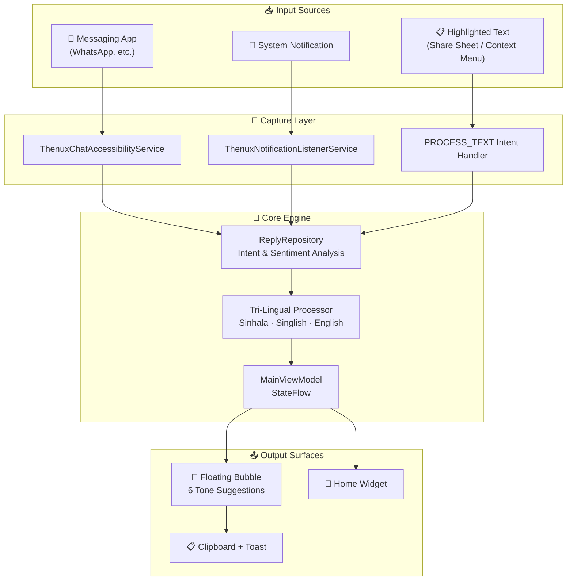

<div align="center">



<br/>

# 🟣 THENUX Reply AI

### Context-Aware, Tri-Lingual Smart Reply Assistant for Android

**Floating AI overlay · Accessibility-powered chat reading · Instant multi-tone replies**

<br/>


<br/>


<br/><br/>

<a href="#-key-features"><b>Features</b></a> ·
<a href="#-architecture"><b>Architecture</b></a> ·
<a href="#-permissions"><b>Permissions</b></a> ·
<a href="#-installation"><b>Install</b></a> ·
<a href="#-play-store-checklist"><b>Play Store Checklist</b></a> ·
<a href="#-tech-stack"><b>Tech Stack</b></a>

</div>

<br/>

<div align="center">

</div>

<br/>

## ⚡ Overview

**THENUX Reply AI** is a floating, always-on-top Android assistant that reads incoming chat context on-device and instantly proposes six ready-to-send replies across different tones and languages — Friendly, Professional, Sinhala, Singlish, Short, and Formal. It runs quietly in the background via an `AccessibilityService` and `NotificationListenerService`, surfacing suggestions the moment a message lands, with zero manual copy-pasting required.

Built entirely with **Jetpack Compose**, **Kotlin Coroutines**, and a reactive **MVVM** architecture, the app ships with a floating bubble overlay, a home-screen widget, system-wide text-selection integration, and a tri-lingual context analysis engine tuned for Sinhala-speaking users.

<br/>

## ✨ Key Features

<table>
<tr>
<td width="50%" valign="top">

### 🫧 Floating AI Assistant Bubble
`ThenuxFloatingBubbleService`

- Always-on-top, unobtrusive overlay across any app
- **Paste & Reply** — paste clipboard text or pull the live detected message directly into the bubble
- Multi-model contextual analysis generates **6 instant replies**:
  - 😊 Friendly · 💼 Professional · 🇱🇰 Sinhala
  - 💬 Singlish · ⚡ Short · 👔 Formal
- One-tap copy to clipboard with instant toast confirmation
- Configurable size, position memory, and auto-clipboard toggle

</td>
<td width="50%" valign="top">

### 👁️ Background Context Reader
`ThenuxChatAccessibilityService`

- Monitors active messaging apps (e.g. WhatsApp) via `AccessibilityService`
- Smart thread parser auto-captures sender name + latest message
- Zero manual entry — fully automatic detection
- Real-time sync into the bubble and dashboard via Kotlin `StateFlow`

</td>
</tr>
<tr>
<td width="50%" valign="top">

### 🔔 Notification Assistant
`ThenuxNotificationListenerService`

- Sniffs incoming chat notifications from supported apps
- Generates quick AI auto-reply proposals straight from the notification shade
- No need to open the source app at all

</td>
<td width="50%" valign="top">

### 🧠 Context AI Analysis Engine
`ReplyRepository`

- Intent & sentiment detection — urgency, action items, open questions, meeting requests, location asks
- Native tri-lingual support: **Sinhala**, **Singlish** (Latin-script Sinhala), and **English**
- Tuned specifically for natural Sri Lankan conversational patterns

</td>
</tr>
<tr>
<td width="50%" valign="top">

### 🔗 System Text Selection & Share
`PROCESS_TEXT` / `SEND` intents

- Highlight any text anywhere on Android — Chrome, Gmail, anywhere
- Select **"THENUX AI"** from the system context menu or share sheet
- Instantly generates smart replies for the selected text

</td>
<td width="50%" valign="top">

### 📲 Home Screen Widget
`ThenuxQuickWidgetProvider`

- Native Android home-screen widget
- One-tap access to launcher actions
- Quick AI analysis without opening the full app

</td>
</tr>
</table>

<br/>

<div align="center">

</div>

<br/>

## 🏗️ Architecture

<div align="center">

</div>



<br/>

## 🛡️ Permissions

| Permission | Manifest Constant | Purpose |
|---|---|---|
| 🌐 Internet Access | `android.permission.INTERNET` | Connects to AI models and cloud services for context analysis |
| 🪟 Display Over Other Apps | `android.permission.SYSTEM_ALERT_WINDOW` | Renders the floating assistant bubble on top of other apps |
| ⚙️ Foreground Service | `android.permission.FOREGROUND_SERVICE` | Keeps the floating assistant running reliably in the background |
| ♿ Accessibility Service | `BIND_ACCESSIBILITY_SERVICE` | Reads on-screen text in active messaging apps to detect received messages |
| 🔔 Notification Listener | `BIND_NOTIFICATION_LISTENER_SERVICE` | Detects incoming chat notifications to generate instant smart replies |

> **⚠️ Accessibility Disclosure:** `AccessibilityService` is used **exclusively on-device** to read incoming chat text for generating real-time contextual AI replies with user consent. No screen content is stored or transmitted beyond what's required for reply generation. See [Privacy Policy](#) for full details.

<br/>

<div align="center">

</div>

<br/>

## 🧰 Tech Stack

<div align="center">


</div>

- **UI Framework:** 100% Jetpack Compose with Material Design 3
- **State Management:** Kotlin Coroutines, `StateFlow`, MVVM (`MainViewModel`)
- **Design:** Responsive edge-to-edge layout, dark/light theme adaptation, rounded surface cards, animated interactive elements
- **AI Layer:** Multi-model contextual analysis (GPT-4 / Gemini–inspired reasoning pipeline)

<br/>

## 📦 Installation

```bash
git clone https://github.com/thenuxofc/thenux-reply-ai.git
cd thenux-reply-ai
```

Open in **Android Studio** (Hedgehog or newer) → let Gradle sync → run on a device or emulator (API 26+ recommended for full `AccessibilityService` + overlay support).

On first launch, grant the following when prompted:
1. **Display over other apps** — required for the floating bubble
2. **Accessibility Service** — required for automatic chat detection
3. **Notification access** — required for notification-based reply suggestions

<br/>

## 🏬 Play Store Checklist

Before publishing publicly, confirm the following:

- [ ] **Accessibility Disclosure** — prominent in-app disclosure + published Privacy Policy URL explaining `AccessibilityService` usage
- [ ] **Overlay Permission Flow** — `SYSTEM_ALERT_WINDOW` request UX tested on first launch
- [ ] **Branding Check** — launcher label in `res/values/strings.xml` matches the desired public store title
- [ ] **Release Signing** — production-signed APK/AAB generated via Android Studio with your production Keystore

<br/>

<div align="center">

</div>

<br/>

<div align="center">

### Built with obsessive attention to detail by **THENUX**


<sub>© 2026 THENUX. All rights reserved.</sub>

</div>
